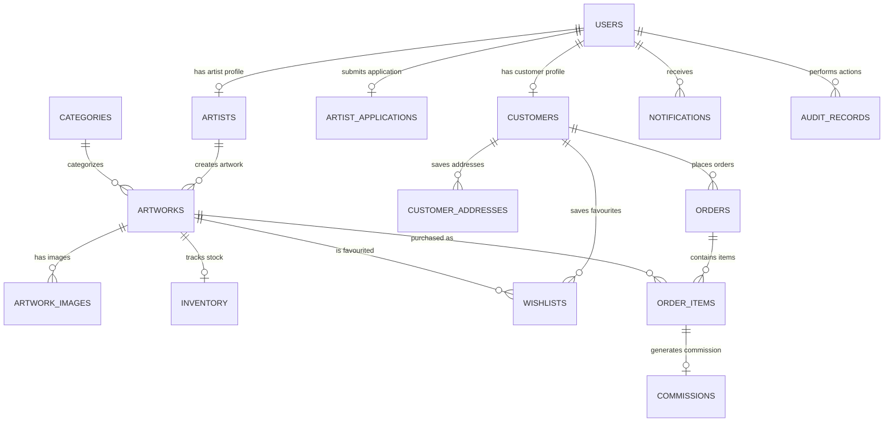

# RICHBECKY GALLERY — STAGE 1 BACKEND & DATABASE FOUNDATION

## Executive Summary

Stage 1 establishes the foundational backend architecture and relational database design for **Richbecky Gallery**. It translates the existing React/Vite frontend mock data structures into a scalable, production-ready backend layout without altering, breaking, or redesigning any existing frontend components, routing, multi-currency system, or responsive UI flows.

---

## 1. Backend Architecture

The backend is organized into a modular TypeScript architecture located under [`src/backend`](file:///c:/Users/USER/Desktop/Richbecky%20Gallery/src/backend). It decouples the UI from core domain business rules and data persistence, making Stage 2 API implementation seamless.

### Directory Structure

```
src/backend/
├── types/                # Domain entity types, DTOs, Enums, and Security interfaces
│   └── index.ts
├── db/                   # Database schemas, relational DDL scripts, seed files & ORM adapter
│   ├── schema.sql        # Production PostgreSQL / Supabase DDL SQL schema with FKs, Check Constraints & RLS
│   ├── seed.sql          # Seed script preserving the 5 real artworks & 3 real artists
│   └── index.ts          # Database repository interface & memory adapter
├── models/               # Domain Entity Models with business logic & constraint rules
│   ├── User.model.ts
│   ├── Customer.model.ts
│   ├── Artist.model.ts
│   ├── Artwork.model.ts
│   ├── ArtworkImage.model.ts
│   ├── Order.model.ts
│   ├── Notification.model.ts
│   └── ...
├── security/             # Authentication contracts, RBAC matrix & environment config validation
│   ├── auth.ts
│   ├── rbac.ts
│   └── env.ts
├── services/             # Application services ready for Stage 2 API handlers
│   ├── artworkService.ts
│   ├── orderService.ts
│   ├── artistService.ts
│   ├── userService.ts
│   └── index.ts
└── index.ts              # Unified backend module entry point
```

---

## 2. Relational Database Design & Entities

The database uses PostgreSQL / Supabase standard relational DDL. Below is the complete table inventory:

| Table Name | Description & Key Responsibilities | Primary Key / Constraints |
| :--- | :--- | :--- |
| **`users`** | Core identity model for Customers, Artists, and Administrators. | `id` (UUID), `email` (UNIQUE), `role` CHECK |
| **`customers`** | Profile, preferences, spend metrics, and account status. | `id` (UUID), `user_id` (FK), `account_number` (UNIQUE) |
| **`customer_addresses`** | Saved shipping & billing addresses. | `id` (UUID), `customer_id` (FK) |
| **`artists`** | Artist profile, biography, statement, country, and commission rate. | `id` (UUID), `user_id` (FK, UNIQUE) |
| **`artist_applications`**| Submissions from prospective artists with admin review workflow. | `id` (UUID), `status` CHECK |
| **`categories`** | Artwork categories (Figurative, Abstract, Landscape, etc.). | `id` (UUID), `slug` (UNIQUE) |
| **`artworks`** | Masterpiece listings (Original Artwork vs Fine Art Print). | `id` (UUID), `slug` (UNIQUE), `quantity` CHECK constraint |
| **`artwork_images`** | Primary & gallery image URLs with alt text & display order. | `id` (UUID), `artwork_id` (FK) |
| **`inventory`** | Fine-grained stock tracking, reserved quantities, and status. | `id` (UUID), `artwork_id` (FK, UNIQUE) |
| **`orders`** | Customer order headers with display currency snapshot totals. | `id` (UUID), `order_number` (UNIQUE), `customer_id` (FK) |
| **`order_items`** | Line items preserving unmutated original price + currency. | `id` (UUID), `order_id` (FK), `artwork_id` (FK) |
| **`wishlists`** | Customer saved favourites. | `id` (UUID), `(customer_id, artwork_id)` UNIQUE constraint |
| **`commissions`** | Gallery vs Artist sales splits calculation log. | `id` (UUID), `order_item_id` (FK, UNIQUE) |
| **`notifications`** | Multi-role platform event notifications (Customer, Artist, Admin). | `id` (UUID), `recipient_id` (FK) |
| **`audit_records`** | Activity log recording for administrative actions. | `id` (UUID), `actor_id` (FK) |
| **`website_content`** | Editable website content sections (Hero, Advisory, FAQs). | `id` (UUID), `section_key` (UNIQUE) |
| **`policies`** | Legal policies (Privacy, Terms, Shipping, Returns, Artist Agreement). | `id` (UUID), `policy_type` (UNIQUE) |
| **`enquiries`** | Artwork inquiries & private viewing requests. | `id` (UUID), `status` CHECK |

---

## 3. Database Relationships



---

## 4. Role-Based Access Control (RBAC) & Permissions

The system enforces strict RBAC across three primary user roles:

1. **Customer**:
   - Browse published artworks, categories, and public artist profiles.
   - Manage saved shipping/billing addresses & wishlist items.
   - Place orders, view own order history, and submit artwork enquiries.
2. **Artist**:
   - Manage artist profile, biography, statement, and social links.
   - Submit new artworks for admin approval (Originals or Prints).
   - View own artwork inventory status, sales metrics, and commission reports.
3. **Administrator**:
   - Full global system authority.
   - Review, approve, or reject pending artist registration applications.
   - Review, approve, or reject pending artwork submissions.
   - Manage order fulfillment statuses, user roles, and platform audit logs.

---

## 5. Core Workflows

### 5.1. Artwork Workflow
```
[ Artist Submission ] ➔ Status: 'Pending Admin Approval'
         │
         ▼
[ Admin Review ]
   ├── Approved ➔ Status: 'Approved' / 'Published' (Visible in Catalogue)
   └── Rejected ➔ Status: 'Rejected' (Reason recorded in Audit log)
         │
         ▼
[ Purchase Event ] ➔ Stock Updated
   ├── Original Artwork: Quantity set to 0 ➔ Status: 'Sold' / 'Not Available'
   └── Fine Art Print: Quantity decremented ➔ Status: 'out_of_stock' when 0
```

### 5.2. Order Workflow (Stage 1 Data Lifecycle)
```
[ Checkout Request ] ➔ Inventory Stock Reserved ('reserved' state)
         │
         ▼
[ Order Creation ] ➔ Historical Price & Currency Snapshot Preserved in order_items
         │
         ▼
[ Fulfillment Lifecycle ] (Admin Managed)
   Pending ➔ Processing ➔ Shipped ➔ Delivered
                                └── Cancelled / Refunded (Stock Released)
```

### 5.3. Commission Calculation Workflow
- Gallery Default Rate: **15%** (configurable per artist in `artists.commission_rate`).
- Artist Share: **85%** of original listing price.
- Preserved in `order_items` and logged in `commissions` table upon order placement.

---

## 6. Multi-Currency Architecture

The system strictly decouples the listing price from the customer's display price:

1. **Original Listing Currency**: Stored in `artworks.original_currency` (e.g. USD, NGN). Never overwritten when customer changes display currency.
2. **Customer Display Currency**: Customer chooses display currency (`USD`, `NGN`, `GBP`, `EUR`, `CAD`, `AUD`).
3. **Dynamic Conversion**: Prices are converted on-the-fly using normalizer exchange rates relative to USD reference.
4. **Order Snapshot**: `order_items` preserves both `original_listing_price` + `original_listing_currency` and `applicable_displayed_price` + `display_currency`.

---

## 7. Environment Variables Configuration

See [`.env.example`](file:///c:/Users/USER/Desktop/Richbecky%20Gallery/.env.example) for required configuration placeholders. Real production credentials must never be committed to git.

---

## 8. Stage 2 Preparation

In **Stage 2**, the following will be implemented on top of this foundation:
- Supabase Client SDK integration & connection.
- REST / GraphQL API endpoints or Supabase Edge Functions.
- Backend authentication middleware (JWT verification / Supabase Auth).
- Live currency exchange rate API integration (OpenExchangeRates / Fixer).
- Real-time inventory reservation locks during checkout.
- Transactional email dispatch using Resend.

---

## 9. Stage 3 Preparation (Client Accounts Required)

For production deployment in **Stage 3**, the client must provide:
1. **Supabase Production Account**: Database URL & Service Role keys.
2. **Resend Account**: API Key & Domain SPF/DKIM verification records for `richbeckygallery.com`.
3. **Payment Gateway Accounts**: Paystack / Stripe live API keys and webhook signing secrets.
4. **Vercel Account**: Production project hosting link & custom domain DNS configuration (`richbeckygallery.com`).
