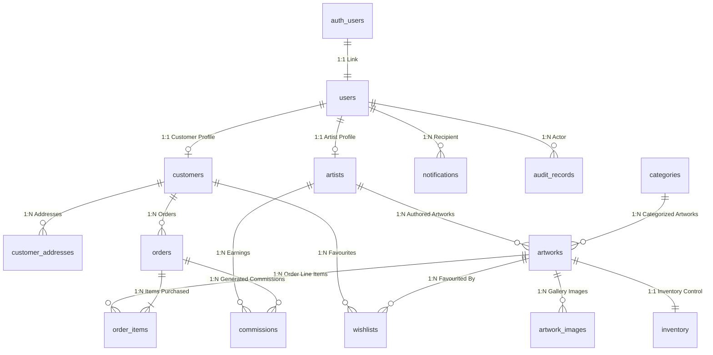

# Implementation Plan — Supabase Migration & Infrastructure Preparation (Stage 1 & Stage 2)

This document presents the technical architecture, database schema, security policies, storage layout, authentication strategy, email transaction triggers, and deployment roadmap to prepare Richbecky Gallery for migration to **Supabase (PostgreSQL + Auth + Storage)** and **Resend**.

> [!IMPORTANT]
> **NO DESTRUCTIVE CHANGES OR LIVE MIGRATION YET**: As instructed, this is a planning and preparation phase only. The existing in-memory repository (`DatabaseMemoryStore`) and Playwright E2E QA test suite remain 100% active and untouched.

---

## User Review Required

> [!NOTE]
> Please review the proposed Supabase database schema, RLS policies, storage bucket architecture, Resend email triggers, and client prerequisites below.
> 
> **Prerequisites Needed From Client Prior to Live Execution**:
> 1. Supabase Project URL (`SUPABASE_URL`) & Public Anon Key (`SUPABASE_ANON_KEY`)
> 2. Supabase Service Role Key (`SUPABASE_SERVICE_ROLE_KEY` for administrative functions)
> 3. Resend API Key (`RESEND_API_KEY`) & verified domain sender email (e.g. `curatorial@richbeckygallery.com`)

---

## Proposed Architectural Schema & Database Blueprint

### A. Supabase Database Tables Required (16 Tables)

Below is the exact SQL DDL mapping derived from all existing domain models in `src/backend/types/index.ts`:

```sql
-- 1. ENUMS & EXTENSIONS
CREATE EXTENSION IF NOT EXISTS "uuid-ossp";

CREATE TYPE system_user_role AS ENUM ('customer', 'artist', 'admin');
CREATE TYPE user_status AS ENUM ('active', 'pending', 'suspended');
CREATE TYPE artist_status_type AS ENUM ('Active', 'Pending Verification', 'Suspended', 'Rejected');
CREATE TYPE application_status_type AS ENUM ('Pending', 'Approved', 'Rejected');
CREATE TYPE artwork_availability_type AS ENUM ('Available', 'Sold', 'Reserved', 'Not for sale');
CREATE TYPE artwork_status_type AS ENUM ('Draft', 'Pending Admin Approval', 'Approved', 'Rejected', 'Published', 'Sold');
CREATE TYPE artwork_category_type AS ENUM ('Original Artwork', 'Fine Art Print');
CREATE TYPE edition_type_enum AS ENUM ('Open Edition', 'Limited Edition');
CREATE TYPE image_type_enum AS ENUM ('primary', 'gallery', 'detail', 'certificate');
CREATE TYPE inventory_status_enum AS ENUM ('in_stock', 'low_stock', 'out_of_stock', 'reserved');
CREATE TYPE order_status_enum AS ENUM ('Pending', 'Processing', 'Shipped', 'Delivered', 'Cancelled', 'Refunded');
CREATE TYPE payment_status_enum AS ENUM ('Pending', 'Paid', 'Failed', 'Refunded');
CREATE TYPE notification_type_enum AS ENUM ('order', 'submission', 'enquiry', 'payout', 'artist', 'system');
CREATE TYPE policy_type_enum AS ENUM ('privacy', 'terms', 'shipping', 'returns', 'artist_agreement', 'copyright');

-- 2. USERS TABLE (Linked to auth.users)
CREATE TABLE public.users (
  id UUID PRIMARY KEY REFERENCES auth.users(id) ON DELETE CASCADE,
  email TEXT UNIQUE NOT NULL,
  role system_user_role NOT NULL DEFAULT 'customer',
  first_name TEXT NOT NULL,
  last_name TEXT NOT NULL,
  phone TEXT,
  profile_image TEXT,
  status user_status NOT NULL DEFAULT 'active',
  last_login TIMESTAMPTZ,
  created_at TIMESTAMPTZ NOT NULL DEFAULT NOW(),
  updated_at TIMESTAMPTZ NOT NULL DEFAULT NOW()
);

-- 3. CUSTOMERS TABLE
CREATE TABLE public.customers (
  id UUID PRIMARY KEY DEFAULT uuid_generate_v4(),
  user_id UUID UNIQUE NOT NULL REFERENCES public.users(id) ON DELETE CASCADE,
  account_number TEXT UNIQUE NOT NULL,
  vip_status TEXT NOT NULL DEFAULT 'Standard',
  total_spend NUMERIC(12,2) NOT NULL DEFAULT 0.00,
  order_count INT NOT NULL DEFAULT 0,
  wishlist_count INT NOT NULL DEFAULT 0,
  preferred_currency TEXT NOT NULL DEFAULT 'USD',
  status user_status NOT NULL DEFAULT 'active',
  created_at TIMESTAMPTZ NOT NULL DEFAULT NOW(),
  updated_at TIMESTAMPTZ NOT NULL DEFAULT NOW()
);

-- 4. CUSTOMER ADDRESSES TABLE
CREATE TABLE public.customer_addresses (
  id UUID PRIMARY KEY DEFAULT uuid_generate_v4(),
  customer_id UUID NOT NULL REFERENCES public.customers(id) ON DELETE CASCADE,
  label TEXT NOT NULL DEFAULT 'Home',
  full_name TEXT NOT NULL,
  email TEXT NOT NULL,
  phone TEXT NOT NULL,
  address_line TEXT NOT NULL,
  city TEXT NOT NULL,
  state_region TEXT,
  country TEXT NOT NULL,
  postal_zip TEXT NOT NULL,
  address_type TEXT NOT NULL DEFAULT 'shipping',
  is_default BOOLEAN NOT NULL DEFAULT FALSE,
  created_at TIMESTAMPTZ NOT NULL DEFAULT NOW(),
  updated_at TIMESTAMPTZ NOT NULL DEFAULT NOW()
);

-- 5. ARTISTS TABLE
CREATE TABLE public.artists (
  id UUID PRIMARY KEY DEFAULT uuid_generate_v4(),
  user_id UUID UNIQUE NOT NULL REFERENCES public.users(id) ON DELETE CASCADE,
  full_name TEXT NOT NULL,
  biography TEXT NOT NULL,
  artist_statement TEXT DEFAULT '',
  profile_image TEXT DEFAULT '',
  cover_image TEXT,
  country TEXT NOT NULL,
  contact_info JSONB NOT NULL DEFAULT '{}'::jsonb,
  social_links JSONB NOT NULL DEFAULT '{}'::jsonb,
  website TEXT,
  exhibitions_count INT NOT NULL DEFAULT 0,
  artworks_count INT NOT NULL DEFAULT 0,
  commission_rate NUMERIC(5,2) NOT NULL DEFAULT 30.00,
  status artist_status_type NOT NULL DEFAULT 'Active',
  approval_status application_status_type NOT NULL DEFAULT 'Approved',
  registration_date TIMESTAMPTZ NOT NULL DEFAULT NOW(),
  approved_date TIMESTAMPTZ,
  created_at TIMESTAMPTZ NOT NULL DEFAULT NOW(),
  updated_at TIMESTAMPTZ NOT NULL DEFAULT NOW()
);

-- 6. ARTIST APPLICATIONS TABLE
CREATE TABLE public.artist_applications (
  id UUID PRIMARY KEY DEFAULT uuid_generate_v4(),
  user_id UUID REFERENCES public.users(id) ON DELETE SET NULL,
  full_name TEXT NOT NULL,
  email TEXT NOT NULL,
  phone TEXT NOT NULL,
  country TEXT NOT NULL,
  city TEXT NOT NULL,
  website TEXT,
  instagram TEXT,
  artist_name TEXT NOT NULL,
  bio TEXT NOT NULL,
  artist_statement TEXT,
  practice_areas TEXT,
  mediums TEXT NOT NULL,
  years_active INT NOT NULL,
  exhibitions TEXT,
  awards TEXT,
  collections TEXT,
  gallery_experience TEXT,
  portfolio_images TEXT[] NOT NULL DEFAULT '{}',
  agreed_to_terms BOOLEAN NOT NULL DEFAULT FALSE,
  status application_status_type NOT NULL DEFAULT 'Pending',
  rejection_reason TEXT,
  submitted_at TIMESTAMPTZ NOT NULL DEFAULT NOW(),
  reviewed_at TIMESTAMPTZ,
  reviewer_id UUID REFERENCES public.users(id),
  admin_notes TEXT
);

-- 7. CATEGORIES TABLE
CREATE TABLE public.categories (
  id UUID PRIMARY KEY DEFAULT uuid_generate_v4(),
  name TEXT UNIQUE NOT NULL,
  slug TEXT UNIQUE NOT NULL,
  description TEXT NOT NULL,
  image TEXT NOT NULL,
  display_order INT NOT NULL DEFAULT 0,
  is_active BOOLEAN NOT NULL DEFAULT TRUE,
  artwork_count INT NOT NULL DEFAULT 0,
  created_at TIMESTAMPTZ NOT NULL DEFAULT NOW(),
  updated_at TIMESTAMPTZ NOT NULL DEFAULT NOW()
);

-- 8. ARTWORKS TABLE
CREATE TABLE public.artworks (
  id UUID PRIMARY KEY DEFAULT uuid_generate_v4(),
  title TEXT NOT NULL,
  artist_id UUID NOT NULL REFERENCES public.artists(id) ON DELETE RESTRICT,
  artist_name_snapshot TEXT NOT NULL,
  description TEXT NOT NULL,
  artwork_story TEXT,
  artist_statement TEXT,
  artwork_type artwork_category_type NOT NULL DEFAULT 'Original Artwork',
  category_id UUID NOT NULL REFERENCES public.categories(id) ON DELETE RESTRICT,
  category_name_snapshot TEXT NOT NULL,
  medium TEXT NOT NULL,
  materials TEXT,
  dimensions_formatted TEXT NOT NULL,
  dimensions_parsed JSONB,
  year_created INT NOT NULL,
  price NUMERIC(12,2) NOT NULL,
  original_currency TEXT NOT NULL DEFAULT 'USD',
  availability artwork_availability_type NOT NULL DEFAULT 'Available',
  quantity INT NOT NULL DEFAULT 1,
  status artwork_status_type NOT NULL DEFAULT 'Pending Admin Approval',
  is_featured BOOLEAN NOT NULL DEFAULT FALSE,
  is_new_arrival BOOLEAN NOT NULL DEFAULT TRUE,
  certificate_included BOOLEAN NOT NULL DEFAULT TRUE,
  certificate_number TEXT,
  certificate_details TEXT,
  edition_info TEXT,
  edition_number TEXT,
  edition_total TEXT,
  edition_type edition_type_enum,
  signature_info TEXT,
  framing_info TEXT,
  fine_art_print_available BOOLEAN DEFAULT FALSE,
  fine_art_print_details TEXT,
  shipping_info_notes TEXT,
  shipping_details TEXT,
  shipping_prep_time TEXT,
  special_handling TEXT,
  slug TEXT UNIQUE NOT NULL,
  primary_image_url TEXT NOT NULL,
  alt_text TEXT,
  created_at TIMESTAMPTZ NOT NULL DEFAULT NOW(),
  updated_at TIMESTAMPTZ NOT NULL DEFAULT NOW(),
  published_at TIMESTAMPTZ
);

-- 9. ARTWORK IMAGES TABLE
CREATE TABLE public.artwork_images (
  id UUID PRIMARY KEY DEFAULT uuid_generate_v4(),
  artwork_id UUID NOT NULL REFERENCES public.artworks(id) ON DELETE CASCADE,
  image_url TEXT NOT NULL,
  image_type image_type_enum NOT NULL DEFAULT 'gallery',
  display_order INT NOT NULL DEFAULT 0,
  is_primary BOOLEAN NOT NULL DEFAULT FALSE,
  alt_text TEXT,
  created_at TIMESTAMPTZ NOT NULL DEFAULT NOW()
);

-- 10. INVENTORY TABLE
CREATE TABLE public.inventory (
  id UUID PRIMARY KEY DEFAULT uuid_generate_v4(),
  artwork_id UUID UNIQUE NOT NULL REFERENCES public.artworks(id) ON DELETE CASCADE,
  quantity INT NOT NULL DEFAULT 1,
  reserved_quantity INT NOT NULL DEFAULT 0,
  available_quantity INT GENERATED ALWAYS AS (quantity - reserved_quantity) STORED,
  status inventory_status_enum NOT NULL DEFAULT 'in_stock',
  last_updated TIMESTAMPTZ NOT NULL DEFAULT NOW()
);

-- 11. ORDERS TABLE
CREATE TABLE public.orders (
  id UUID PRIMARY KEY DEFAULT uuid_generate_v4(),
  order_number TEXT UNIQUE NOT NULL,
  customer_id UUID NOT NULL REFERENCES public.customers(id) ON DELETE RESTRICT,
  order_date TIMESTAMPTZ NOT NULL DEFAULT NOW(),
  status order_status_enum NOT NULL DEFAULT 'Pending',
  payment_status payment_status_enum NOT NULL DEFAULT 'Pending',
  display_currency TEXT NOT NULL DEFAULT 'USD',
  subtotal NUMERIC(12,2) NOT NULL,
  shipping_fee NUMERIC(12,2) NOT NULL DEFAULT 0.00,
  total NUMERIC(12,2) NOT NULL,
  shipping_address JSONB NOT NULL,
  billing_address JSONB,
  payment_method TEXT NOT NULL DEFAULT 'Card',
  tracking_number TEXT,
  created_at TIMESTAMPTZ NOT NULL DEFAULT NOW(),
  updated_at TIMESTAMPTZ NOT NULL DEFAULT NOW()
);

-- 12. ORDER ITEMS TABLE
CREATE TABLE public.order_items (
  id UUID PRIMARY KEY DEFAULT uuid_generate_v4(),
  order_id UUID NOT NULL REFERENCES public.orders(id) ON DELETE CASCADE,
  artwork_id UUID NOT NULL REFERENCES public.artworks(id) ON DELETE RESTRICT,
  artist_id UUID NOT NULL REFERENCES public.artists(id) ON DELETE RESTRICT,
  artwork_title_snapshot TEXT NOT NULL,
  artwork_type_snapshot artwork_category_type NOT NULL,
  quantity INT NOT NULL DEFAULT 1,
  original_listing_price NUMERIC(12,2) NOT NULL,
  original_listing_currency TEXT NOT NULL,
  applicable_displayed_price NUMERIC(12,2) NOT NULL,
  display_currency TEXT NOT NULL,
  commission_rate NUMERIC(5,2) NOT NULL DEFAULT 30.00,
  artist_share_amount NUMERIC(12,2) NOT NULL,
  gallery_share_amount NUMERIC(12,2) NOT NULL,
  created_at TIMESTAMPTZ NOT NULL DEFAULT NOW()
);

-- 13. WISHLISTS / FAVOURITES TABLE
CREATE TABLE public.wishlists (
  id UUID PRIMARY KEY DEFAULT uuid_generate_v4(),
  customer_id UUID NOT NULL REFERENCES public.customers(id) ON DELETE CASCADE,
  artwork_id UUID NOT NULL REFERENCES public.artworks(id) ON DELETE CASCADE,
  created_at TIMESTAMPTZ NOT NULL DEFAULT NOW(),
  UNIQUE(customer_id, artwork_id)
);

-- 14. COMMISSIONS TABLE
CREATE TABLE public.commissions (
  id UUID PRIMARY KEY DEFAULT uuid_generate_v4(),
  order_id UUID NOT NULL REFERENCES public.orders(id) ON DELETE CASCADE,
  order_item_id UUID NOT NULL REFERENCES public.order_items(id) ON DELETE CASCADE,
  artist_id UUID NOT NULL REFERENCES public.artists(id) ON DELETE RESTRICT,
  sale_amount NUMERIC(12,2) NOT NULL,
  currency TEXT NOT NULL,
  commission_percentage NUMERIC(5,2) NOT NULL DEFAULT 30.00,
  artist_share NUMERIC(12,2) NOT NULL,
  gallery_share NUMERIC(12,2) NOT NULL,
  commission_status TEXT NOT NULL DEFAULT 'pending',
  payout_status TEXT NOT NULL DEFAULT 'unpaid',
  payout_id UUID,
  created_at TIMESTAMPTZ NOT NULL DEFAULT NOW(),
  updated_at TIMESTAMPTZ NOT NULL DEFAULT NOW()
);

-- 15. NOTIFICATIONS TABLE
CREATE TABLE public.notifications (
  id UUID PRIMARY KEY DEFAULT uuid_generate_v4(),
  recipient_id UUID NOT NULL REFERENCES public.users(id) ON DELETE CASCADE,
  recipient_role system_user_role NOT NULL,
  type notification_type_enum NOT NULL,
  title TEXT NOT NULL,
  message TEXT NOT NULL,
  read BOOLEAN NOT NULL DEFAULT FALSE,
  metadata JSONB,
  created_at TIMESTAMPTZ NOT NULL DEFAULT NOW()
);

-- 16. AUDIT RECORDS TABLE
CREATE TABLE public.audit_records (
  id UUID PRIMARY KEY DEFAULT uuid_generate_v4(),
  actor_id UUID REFERENCES public.users(id) ON DELETE SET NULL,
  actor_email TEXT NOT NULL,
  actor_role system_user_role NOT NULL,
  action TEXT NOT NULL,
  affected_entity TEXT NOT NULL,
  affected_entity_id TEXT NOT NULL,
  metadata JSONB,
  timestamp TIMESTAMPTZ NOT NULL DEFAULT NOW()
);
```

---

### B. Database Relationships Diagram (Mermaid)



---

### C. Row Level Security (RLS) Policy Plan

```sql
-- Enable RLS on all tables
ALTER TABLE public.users ENABLE ROW LEVEL SECURITY;
ALTER TABLE public.customers ENABLE ROW LEVEL SECURITY;
ALTER TABLE public.customer_addresses ENABLE ROW LEVEL SECURITY;
ALTER TABLE public.artists ENABLE ROW LEVEL SECURITY;
ALTER TABLE public.artist_applications ENABLE ROW LEVEL SECURITY;
ALTER TABLE public.artworks ENABLE ROW LEVEL SECURITY;
ALTER TABLE public.artwork_images ENABLE ROW LEVEL SECURITY;
ALTER TABLE public.inventory ENABLE ROW LEVEL SECURITY;
ALTER TABLE public.orders ENABLE ROW LEVEL SECURITY;
ALTER TABLE public.order_items ENABLE ROW LEVEL SECURITY;
ALTER TABLE public.wishlists ENABLE ROW LEVEL SECURITY;
ALTER TABLE public.commissions ENABLE ROW LEVEL SECURITY;
ALTER TABLE public.notifications ENABLE ROW LEVEL SECURITY;
ALTER TABLE public.audit_records ENABLE ROW LEVEL SECURITY;

-- 1. USERS & PROFILES
CREATE POLICY "Public profiles read policy" ON public.users FOR SELECT USING (true);
CREATE POLICY "Users edit own profile" ON public.users FOR UPDATE USING (auth.uid() = id);

-- 2. ARTWORKS & CATALOGUE (Public reads approved/published artworks)
CREATE POLICY "Public catalogue view" ON public.artworks FOR SELECT USING (status IN ('Approved', 'Published', 'Sold'));
CREATE POLICY "Artist view own pending artworks" ON public.artworks FOR SELECT USING (
  artist_id IN (SELECT id FROM public.artists WHERE user_id = auth.uid())
);
CREATE POLICY "Artist submit artwork" ON public.artworks FOR INSERT WITH CHECK (
  artist_id IN (SELECT id FROM public.artists WHERE user_id = auth.uid())
);
CREATE POLICY "Admin full artwork management" ON public.artworks FOR ALL USING (
  EXISTS (SELECT 1 FROM public.users WHERE id = auth.uid() AND role = 'admin')
);

-- 3. ARTIST APPLICATIONS
CREATE POLICY "Anyone can submit artist application" ON public.artist_applications FOR INSERT WITH CHECK (true);
CREATE POLICY "Applicant view own application" ON public.artist_applications FOR SELECT USING (
  email IN (SELECT email FROM public.users WHERE id = auth.uid())
);
CREATE POLICY "Admin manage applications" ON public.artist_applications FOR ALL USING (
  EXISTS (SELECT 1 FROM public.users WHERE id = auth.uid() AND role = 'admin')
);

-- 4. ORDERS & COMMISSIONS
CREATE POLICY "Customer view own orders" ON public.orders FOR SELECT USING (
  customer_id IN (SELECT id FROM public.customers WHERE user_id = auth.uid())
);
CREATE POLICY "Artist view own sales commissions" ON public.commissions FOR SELECT USING (
  artist_id IN (SELECT id FROM public.artists WHERE user_id = auth.uid())
);
CREATE POLICY "Admin manage orders and commissions" ON public.orders FOR ALL USING (
  EXISTS (SELECT 1 FROM public.users WHERE id = auth.uid() AND role = 'admin')
);
```

---

### D. Authentication Migration Strategy

1. **Supabase Auth Trigger (`public.users` Sync)**:
   - When a user signs up via Supabase Auth (`supabase.auth.signUp()`), an automated PostgreSQL trigger executes:
```sql
CREATE OR REPLACE FUNCTION public.handle_new_user()
RETURNS TRIGGER AS $$
BEGIN
  INSERT INTO public.users (id, email, first_name, last_name, role, status)
  VALUES (
    NEW.id,
    NEW.email,
    COALESCE(NEW.raw_user_meta_data->>'first_name', 'Collector'),
    COALESCE(NEW.raw_user_meta_data->>'last_name', 'Patron'),
    COALESCE((NEW.raw_user_meta_data->>'role')::system_user_role, 'customer'),
    'active'
  );
  RETURN NEW;
END;
$$ LANGUAGE plpgsql SECURITY DEFINER;

CREATE TRIGGER on_auth_user_created
  AFTER INSERT ON auth.users
  FOR EACH ROW EXECUTE FUNCTION public.handle_new_user();
```

2. **Session Persistence & Tokens**:
   - Replace mock `rbg_auth_user` in `localStorage` with `supabase.auth.onAuthStateChange((event, session) => ...)` inside `GalleryContext.tsx`.

---

### E. Supabase Storage Architecture

1. **Buckets**:
   - `artwork-images` (Public): High-resolution artwork primary, gallery, and detail photos.
   - `artist-portfolios` (Public): Artist profile photos, cover images, and curatorial PDF submissions.
   - `certificates` (Private / Restricted): Digital Certificates of Authenticity accessible only to purchasing collectors and gallery admins.

2. **Storage Path Hierarchy**:
   - `artwork-images/{artist_id}/{artwork_slug}/primary.webp`
   - `artwork-images/{artist_id}/{artwork_slug}/gallery-1.webp`
   - `certificates/{artwork_id}/coa_{certificate_number}.pdf`

---

### F. Migration Strategy for Existing 5 Production Artworks

Existing artworks in `src/backend/db/index.ts` will be seeded into PostgreSQL via a migration script:

1. **ISEMBAYE** ($365 USD) — Artist: Kolawole Adedeji
2. **THIS IS OUR WAY** (₦250,000 NGN) — **Artist: Kolawole Adedeji** *(MANDATORY Integrity Check)*
3. **THE FIRST DIALOGUE** ($182 USD) — Artist: Rebecca Esho
4. **UNDER OUR NEW GARMENT** ($182 USD) — Artist: Rebecca Esho
5. **Thought of Hope** ($182 USD) — Artist: Rebecca Esho

---

### G. Resend Email Integration Plan

Transactional emails to trigger via Resend SDK (`resend.emails.send()`):

1. **Customer Registration**: Welcome to Richbecky Gallery VIP Collector Community.
2. **Artist Application Received**: Confirmation receipt of curatorial submission.
3. **Artist Application Approved**: Welcome to Represented Artist Studio with login credentials link.
4. **Artist Application Rejected**: Curatorial update notice with feedback.
5. **Artwork Submitted**: Received for curatorial review notification sent to artist & admin.
6. **Artwork Approved**: Published to public catalogue confirmation.
7. **Artwork Rejected**: Revision/curatorial feedback notice.

---

### H. Required Environment Variables Blueprint

```env
# Frontend (Client-side exposed)
VITE_SUPABASE_URL=https://your-project.supabase.co
VITE_SUPABASE_ANON_KEY=eyJhbGciOiJIUzI1NiIsInR5cCI6IkpXVCJ9...

# Backend / Server-side Only (Never commit or expose to client bundle)
SUPABASE_SERVICE_ROLE_KEY=eyJhbGciOiJIUzI1NiIsInR5cCI6IkpXVCJ9...
RESEND_API_KEY=re_123456789...
CURATORIAL_SENDER_EMAIL=advisory@richbeckygallery.com
```

---

### I. Summary Checklist: Client Dependencies & Execution Split

| Action Item | Status | Execution Dependency |
| :--- | :--- | :--- |
| **SQL DDL & RLS Blueprint** | ✅ Prepared | Can be drafted without live Supabase access. |
| **Supabase Client Wrapper Types** | ✅ Prepared | Can be added to `src/backend/db/supabase.ts` safely. |
| **Resend Email Templates** | ✅ Prepared | Can be written in `src/services/emailService.ts`. |
| **Executing SQL DDL on Live DB** | ⏳ Pending | **Requires Client Supabase Credentials** |
| **Live Supabase Auth & Storage** | ⏳ Pending | **Requires Client Supabase Credentials** |
| **Live Resend API Email Delivery** | ⏳ Pending | **Requires Client Resend API Key** |

---

## Verification Plan

### Automated Tests
- `npm run test:e2e`: Keep all 13 Playwright test specifications running against `DatabaseMemoryStore` until live Supabase credentials are provided.
- `npm run build`: Verify TypeScript compilation and production bundle integrity.

### Manual Verification
- Review schema DDL, RLS policies, and email triggers with the client before live execution.
